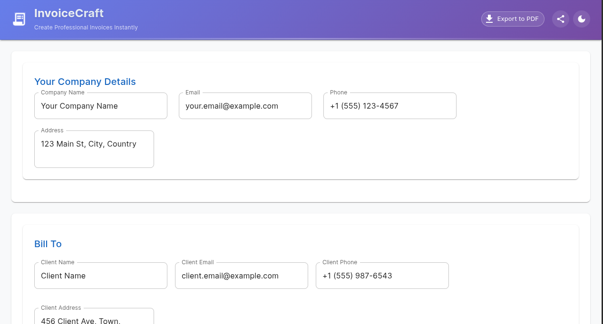
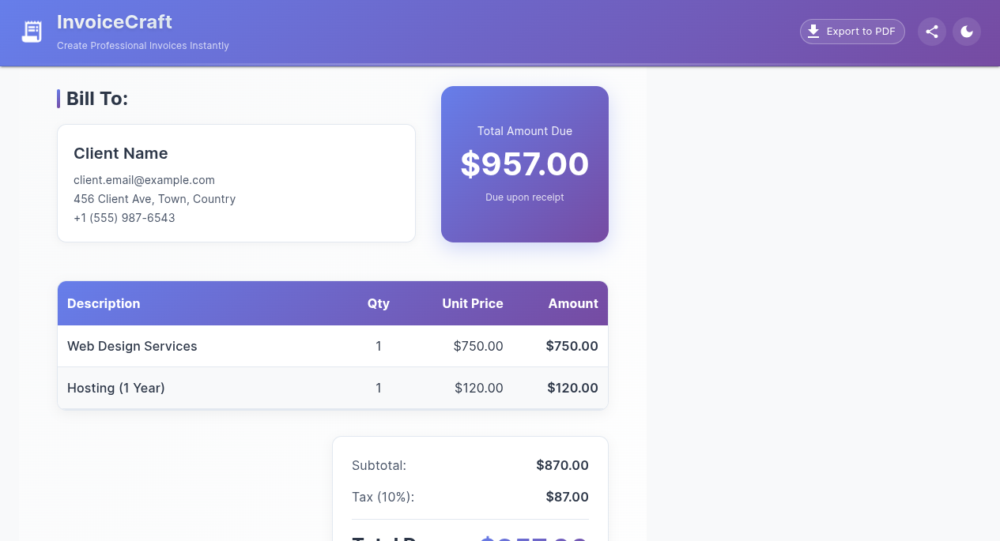

# 💼 Invoice Creator - Professional Invoice Generator

A stunning, responsive invoice generator built with React and Material-UI. Create professional invoices in seconds and export them as beautiful PDFs.


## 🚀 Live Demo

👉 **[View Live Application](https://invoice-creator-view.vercel.app/)**

## ✨ Features

- 🎨 **Stunning UI** - Professional design with Material-UI
- 📱 **Fully Responsive** - Works perfectly on all devices
- 📄 **PDF Export** - Download invoices as professional PDFs
- 💰 **Auto Calculations** - Real-time totals with tax and discount
- 🏢 **Company Branding** - Add your company details
- 👥 **Client Management** - Save client information
- 🎯 **Dynamic Items** - Add, edit, remove invoice items
- 🌙 **Dark/Light Mode** - Beautiful theme toggle

## 📸 Screenshots


## Screenshot 1


## Screenshot 2


## 🛠️ Tech Stack

- **Frontend**: React 19, Material-UI 5
- **PDF Generation**: jsPDF, html2canvas
- **Icons**: Material Icons
- **Build Tool**: Create React App
- **Deployment**: GitHub Pages

## 🚀 Quick Start

```bash
# Clone repository
git clone https://github.com/mohakamran/invoice-creator.git

# Install dependencies
npm install

# Run development server
npm start
